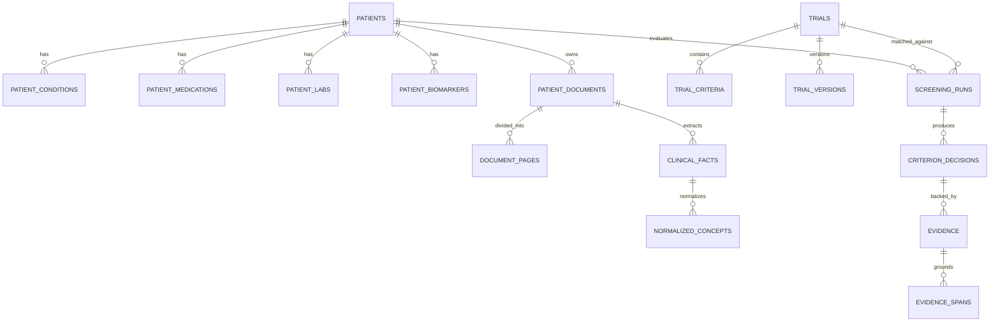

# Data Model Specification

## 1. Relational Schema Summary (41 Tables)

The system database requires 41 primary tables designed with explicit foreign key constraints, versioning, auditability, and clear lineage tracking.

---

## 2. Table Specifications

### 2.1 Core Identity & User Roles
- `profiles`: User account details (`id`, `email`, `role` enum: admin, research_coordinator, investigator, reviewer, viewer, `full_name`, `created_at`, `updated_at`).
- `consents`: Patient simulation consent tracking (`id`, `patient_id`, `consent_type`, `granted_at`, `status`).

### 2.2 Synthetic Patient Clinical Domain
- `patients`: Synthetic patient header (`id`, `mrn_synthetic`, `age`, `gender`, `ethnicity`, `status`, `created_at`, `updated_at`).
- `patient_conditions`: Diagnoses (`id`, `patient_id`, `raw_text`, `normalized_code`, `stage`, `onset_date`, `status`, `version`, `source_document_id`).
- `patient_medications`: Prescriptions (`id`, `patient_id`, `raw_text`, `drug_name`, `dosage`, `frequency`, `start_date`, `end_date`, `status`).
- `patient_labs`: Lab results (`id`, `patient_id`, `test_name`, `numeric_value`, `unit`, `reference_range`, `lab_date`, `source_document_id`).
- `patient_biomarkers`: Genomic & biomarker markers (`id`, `patient_id`, `biomarker_name`, `status_value` (e.g. POSITIVE/MUTATED), `variant`, `test_date`).
- `patient_timeline`: Longitudinal clinical event timeline (`id`, `patient_id`, `event_type`, `event_date`, `summary`, `source_fact_id`).

### 2.3 Document Storage & Natural Language Processing
- `patient_documents`: Uploaded synthetic clinical files (`id`, `patient_id`, `file_name`, `file_type`, `storage_path`, `upload_date`, `processing_status`).
- `document_pages`: Page text storage (`id`, `document_id`, `page_number`, `raw_text`, `ocr_confidence`).
- `document_extractions`: Raw extraction runs (`id`, `document_id`, `extractor_version`, `raw_json`, `created_at`).
- `clinical_facts`: Extracted atomic facts (`id`, `patient_id`, `document_id`, `fact_type`, `raw_text`, `start_char`, `end_char`, `page_number`, `veracity`).
- `normalized_concepts`: Normalized ontology entities (`id`, `fact_id`, `coding_system`, `concept_id`, `preferred_label`, `confidence`, `mapping_method`).
- `terminology_mappings`: Local ontology dictionary cache (`id`, `source_term`, `target_system`, `target_code`, `target_label`).

### 2.4 Clinical Trials & Protocols
- `trials`: Imported protocol metadata (`id`, `nct_id`, `title`, `phase`, `recruitment_status`, `sponsor`, `min_age`, `max_age`, `gender_target`, `version`).
- `trial_sites`: Locations & recruitment contacts (`id`, `trial_id`, `facility_name`, `city`, `state`, `country`, `status`).
- `trial_versions`: Historical protocol amendments (`id`, `trial_id`, `version_number`, `change_summary`, `effective_date`).
- `trial_criteria`: Eligibility requirements (`id`, `trial_id`, `criterion_type` (inclusion/exclusion), `category`, `raw_text`, `rule_type`, `version`).
- `trial_criterion_versions`: Criteria versioning (`id`, `criterion_id`, `version_number`, `raw_text`, `structured_logic`).
- `criterion_logic_nodes`: Parsed AST/boolean rule node (`id`, `criterion_id`, `field`, `operator`, `value`, `unit`, `temporal_window`).

### 2.5 Screening Engine & Decision Support
- `screening_runs`: Full patient-trial matching execution (`id`, `patient_id`, `trial_id`, `overall_state` (eligible_for_review, potentially_eligible, not_eligible, manual_review_required, expired_match), `ai_provider`, `rule_engine_version`, `created_at`).
- `screening_results`: Summary of criterion counts (`id`, `screening_run_id`, `pass_count`, `fail_count`, `unknown_count`, `conflict_count`).
- `criterion_decisions`: Individual criterion evaluation (`id`, `screening_run_id`, `criterion_id`, `decision_state` (PASS, FAIL, UNKNOWN, CONFLICT), `confidence`, `explanation`).
- `evidence`: Grounding evidence records (`id`, `criterion_decision_id`, `patient_fact_id`, `reliability_score`).
- `evidence_spans`: Exact document highlight spans (`id`, `evidence_id`, `document_id`, `page_number`, `start_char`, `end_char`, `snippet`).
- `evidence_reliability`: Source authority scoring (`id`, `evidence_id`, `source_type`, `reliability_weight`).
- `temporal_assertions`: Evaluated temporal constraints (`id`, `criterion_decision_id`, `temporal_expression`, `validated`, `reference_date`).
- `conflict_cases`: Detected evidence contradictions (`id`, `screening_run_id`, `conflict_type`, `fact_a_id`, `fact_b_id`, `resolution_status`).

### 2.6 Advanced Operations & Simulator
- `what_if_scenarios`: Simulation runs (`id`, `patient_id`, `trial_id`, `scenario_name`, `modified_facts_json`, `simulated_screening_result_json`, `created_by`).
- `eligibility_timelines`: Patient historical eligibility trajectory (`id`, `patient_id`, `trial_id`, `timestamp`, `screening_run_id`, `state`).
- `criteria_change_impacts`: Protocol modification impact report (`id`, `trial_version_id`, `criterion_id`, `affected_patients_count`, `diff_summary`).
- `re_screening_jobs`: Asynchronous re-screening queue (`id`, `trigger_type`, `patient_id`, `trial_id`, `status`, `scheduled_at`, `completed_at`).

### 2.7 Review, Analytics & Governance
- `reviews`: Human coordinator/investigator determinations (`id`, `screening_run_id`, `reviewer_id`, `human_state`, `override_flag`, `override_reason`, `created_at`).
- `researcher_feedback`: Reviewer feedback on extraction/matching (`id`, `screening_run_id`, `feedback_type`, `comment`, `corrected_value`, `created_by`).
- `disagreement_analytics`: AI vs Human disagreement tracking (`id`, `screening_run_id`, `criterion_id`, `ai_decision`, `human_decision`, `disagreement_category`).
- `notifications`: CRC alert messages (`id`, `user_id`, `title`, `message`, `link`, `is_read`, `created_at`).
- `audit_logs`: Immutable compliance audit trail (`id`, `user_id`, `action`, `entity_type`, `entity_id`, `payload_json`, `ip_address`, `timestamp`).

### 2.8 Evaluation Module
- `evaluation_datasets`: Benchmark test suites (`id`, `name`, `version`, `description`, `created_at`).
- `evaluation_cases`: Annotated test cases (`id`, `dataset_id`, `patient_snapshot_json`, `trial_criterion_json`, `gold_decision`, `gold_grounding_json`).
- `evaluation_predictions`: Output generated by system (`id`, `evaluation_case_id`, `predicted_decision`, `predicted_grounding_json`, `ai_provider_used`).
- `evaluation_metrics`: Execution evaluation report (`id`, `dataset_id`, `ai_provider`, `accuracy`, `precision`, `recall`, `f1_score`, `negation_acc`, `temporal_acc`, `traceability_score`, `created_at`).
