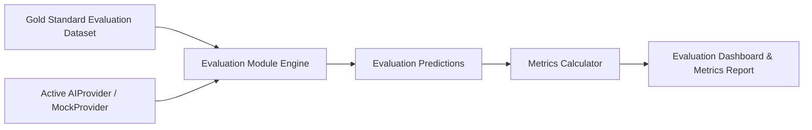

# Evaluation Plan & Metrics Framework

## 1. Overview
The system features an automated, repeatable evaluation module that benchmarks system extractions, rule evaluations, and matching decisions against a gold-standard labelled test dataset.

> **CRITICAL EVALUATION RULE:**  
> Target performance metrics represent **evaluation benchmarks**, not claimed results. The system automatically measures actual performance during test harness runs. Target metrics are never hardcoded or displayed as achieved without empirical execution against gold-standard evaluation cases.

---

## 2. Target Performance Benchmarks & Measurement Methodologies

| Metric Domain | Target Benchmark | Measurement Formula / Methodology | Gold Standard Benchmark Data |
| :--- | :---: | :--- | :--- |
| **Criterion Classification** | $\ge 93\%$ | **Accuracy & Macro F1 Score** of categorizing criteria into domain buckets (e.g. Lab Range, Diagnosis, Medication, Prior Therapy, Biomarker). | 200 annotated criteria statements labelled by clinical domain. |
| **Eligibility Extraction** | $\ge 92\%$ | **Exact Match & Overlap F1** of extracted trial inclusion/exclusion entities compared to gold criteria logic. | 150 protocol text snippets with ground truth entity spans. |
| **Medical Normalization** | $\ge 90\%$ | **Top-1 Categorical Accuracy** matching raw terms (e.g. "pembrolizumab", "NSCLC") to correct standard terminology codes (RxNorm, SNOMED, LOINC). | 300 clinical term mapping pairs. |
| **Negation Detection** | $\ge 98\%$ | **Binary Classification F1 Score** detecting negated expressions vs non-negated statements. | 250 clinical text spans containing explicit and subtle negation triggers. |
| **Temporal Validation** | $\ge 95\%$ | **Temporal Constraint Accuracy** evaluating relative dates (e.g. "within 30 days prior") against clinical timeline events. | 100 temporal scenario test vectors. |
| **Missing-Data Detection** | $\ge 95\%$ | **Recall of UNKNOWN State** when required clinical facts (e.g., lab value) are absent from patient profile. | 100 incomplete patient profiles tested against criterion requirements. |
| **Conflict Detection** | $\ge 90\%$ | **Recall of CONFLICT State** when contradictory evidence (e.g., two different biomarker states in the same window) exists. | 50 synthetic patient profiles containing intentional clinical contradictions. |
| **Evidence Grounding** | $\ge 93\%$ | **IoU (Intersection over Union)** of character start/end spans and page numbers between predicted evidence and gold spans. | 200 grounded evidence annotations. |
| **Overall Matching** | $\ge 93\%$ | **Confusion Matrix Accuracy & Weighted F1** across final screening states (`eligible_for_review`, `potentially_eligible`, `not_eligible`, `manual_review_required`). | 100 synthetic patient-trial evaluation pairs. |
| **Decision Traceability** | $100\%$ | **Completeness Percentage** of audit logs recording snapshot data, criteria versions, AI provider, rule version, and timestamps. | 100% mandatory compliance check across all generated screening runs. |

---

## 3. Evaluation Pipeline Execution Flow

1. **Dataset Loading**: Ingest synthetic test set (`evaluation_datasets` and `evaluation_cases`).
2. **Batch Execution**: Run extraction, normalization, negation, and matching algorithms across test cases.
3. **Metric Calculation**: Compare predicted outputs with gold-standard annotations. Compute precision, recall, F1, accuracy, and IoU.
4. **Dashboard Reporting**: Display tabular performance breakdown, confusion matrices, and calibration error graphs on the frontend Evaluation Page.
