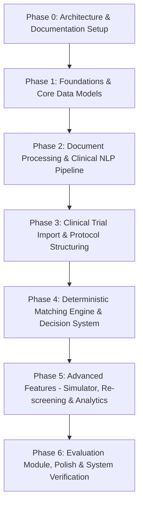

# Comprehensive Implementation Plan

## 1. Project Overview & Scope
The **AI Clinical Trial Matching & Research Assistant** is a modular-monolith web application built to streamline clinical trial pre-screening for research coordinators and investigators using synthetic patient data, ClinicalTrials.gov protocols, deterministic rule engines, and AI extraction services.

---

## 2. Feature-to-Module Mapping

| Feature Domain | Backend Module Location | Key Responsibilities |
| :--- | :--- | :--- |
| **Authentication & RBAC** | `backend/app/modules/auth` | User sessions, roles (`admin`, `research_coordinator`, `investigator`, `reviewer`, `viewer`), route security. |
| **Patient Profile & Clinical Data** | `backend/app/modules/patients` | Synthetic patient profiles, conditions, medications, lab values, biomarkers, longitudinal timeline. |
| **Document Ingestion & OCR** | `backend/app/modules/documents` | PyMuPDF parsing, Tesseract OCR fallback, page-level text storage, text span extraction. |
| **Clinical NLP Extraction** | `backend/app/modules/extraction` | Rule-based & AI-assisted clinical fact extraction from unstructured patient records. |
| **Terminology Normalization** | `backend/app/modules/normalization` | Coding mapping to RxNorm, LOINC, SNOMED, ICD-10. Preserves original raw text. |
| **Negation & Temporal Logic** | `backend/app/modules/temporal`, `negation` | Contextual negation scope detection, relative temporal condition validation against enrollment dates. |
| **Trial Proxy & Import** | `backend/app/modules/trials`, `protocols` | ClinicalTrials.gov API REST v2 proxy, trial normalization, version tracking. |
| **Criteria Parsing & Structuring** | `backend/app/modules/criteria` | Extraction of inclusion/exclusion criteria into structured logic nodes and logic trees. |
| **Matching & Rule Engine** | `backend/app/modules/matching` | Deterministic evaluation of patient facts against trial rules. Computes `PASS`, `FAIL`, `UNKNOWN`, `CONFLICT`. |
| **Evidence Grounding & Conflicts** | `backend/app/modules/evidence`, `conflicts` | Character span grounding, source document page linkage, clinical evidence conflict detection and resolution. |
| **What-If Simulation** | `backend/app/modules/what_if` | Hypothetical patient attribute modification without altering canonical database records. |
| **Continuous Re-screening & Impact** | `backend/app/modules/rescreening`, `impact_analysis` | Triggered background re-screening on data/protocol edits; protocol change diff analysis. |
| **Review & Audit Trail** | `backend/app/modules/review`, `audit` | Human coordinator/investigator determinations, override reasons, 100% immutable audit logging. |
| **AI vs Human Disagreement** | `backend/app/modules/feedback` | Analytics on decision disputes, error categorization, researcher feedback loop. |
| **Evaluation Module** | `backend/app/modules/evaluation` | Repeatable benchmarking harness measuring system performance against gold-standard synthetic dataset. |
| **Dashboard & Alerts** | `backend/app/modules/dashboard`, `notifications` | Role-specific metrics, workload summary, coordinator alert queue. |

---

## 3. Implementation Phases Plan

### Phase 0: Workspace Setup & Specification (COMPLETED IN THIS STEP)
- [x] Inspect workspace.
- [x] Create comprehensive architecture, workflow, data model, API spec, evaluation plan, and security docs.
- [x] Create root configuration (`README.md`, `.env.example`, `.gitignore`).
- [x] Create module directory scaffolding for frontend and backend.

### Phase 1: Foundations & Core Data Models (Next Step upon Approval)
- Setup FastAPI backend with Pydantic & SQLAlchemy models for all 41 tables.
- Setup React + Vite + TypeScript + Tailwind frontend skeleton.
- Implement Auth, RBAC middleware, and synthetic patient management APIs/pages.
- Implement mock AI provider and health status endpoint.

### Phase 2: Document Processing & Clinical NLP Pipeline
- Implement PDF parsing (PyMuPDF) and Tesseract OCR fallback.
- Implement clinical fact extraction, medical term normalization (RxNorm/LOINC/SNOMED), negation detection, and temporal reasoning.
- Build document upload & verification UI with text span highlighting.

### Phase 3: Clinical Trial Import & Protocol Structuring
- Implement ClinicalTrials.gov REST API v2 proxy integration.
- Implement trial criteria extraction and structuring into logic nodes.
- Build trial search, details, and protocol versioning UI.

### Phase 4: Deterministic Matching Engine & Decision System
- Implement rule-engine evaluation producing 4-state criteria outputs (`PASS`, `FAIL`, `UNKNOWN`, `CONFLICT`).
- Implement 5-state overall screening classification (`eligible_for_review`, `potentially_eligible`, `not_eligible`, `manual_review_required`, `expired_match`).
- Build evidence grounding UI and side-by-side verification screen.
- Implement human coordinator/investigator review workflow and audit logging.

### Phase 5: Advanced Operations (Simulator, Re-Screening & Disagreements)
- Implement what-if hypothetical simulator.
- Implement automated background re-screening and trial criteria change impact analysis.
- Implement clinical conflict resolver screen.
- Build AI vs Human disagreement analytics dashboard and researcher feedback loop.

### Phase 6: Repeatable Evaluation Module & System Validation
- Implement synthetic gold-standard benchmark dataset (`evaluation_datasets`).
- Build evaluation test runner measuring precision, recall, F1, accuracy, and IoU grounding across targets.
- Create system dashboard displaying empirical performance metrics.

---

## 4. Risks & Limitations

1. **Synthetic Data Boundaries**: Synthetic patient records may not capture all real-world clinical edge cases or complex formatting variations in physical hospital documents.
2. **Deterministic Rule Limits**: Complex clinical protocols with ambiguous natural language phrasing (e.g. "investigator discretion") require human coordinator mapping to standard logic operators.
3. **LLM Hallucination Risk**: AI extractions are strictly verified by deterministic rule evaluation and human review; raw AI responses are never directly written to canonical eligibility statuses without validation.
4. **Third-Party API Rate Limits**: ClinicalTrials.gov API calls are cached server-side to prevent throttling and ensure offline prototype stability.
