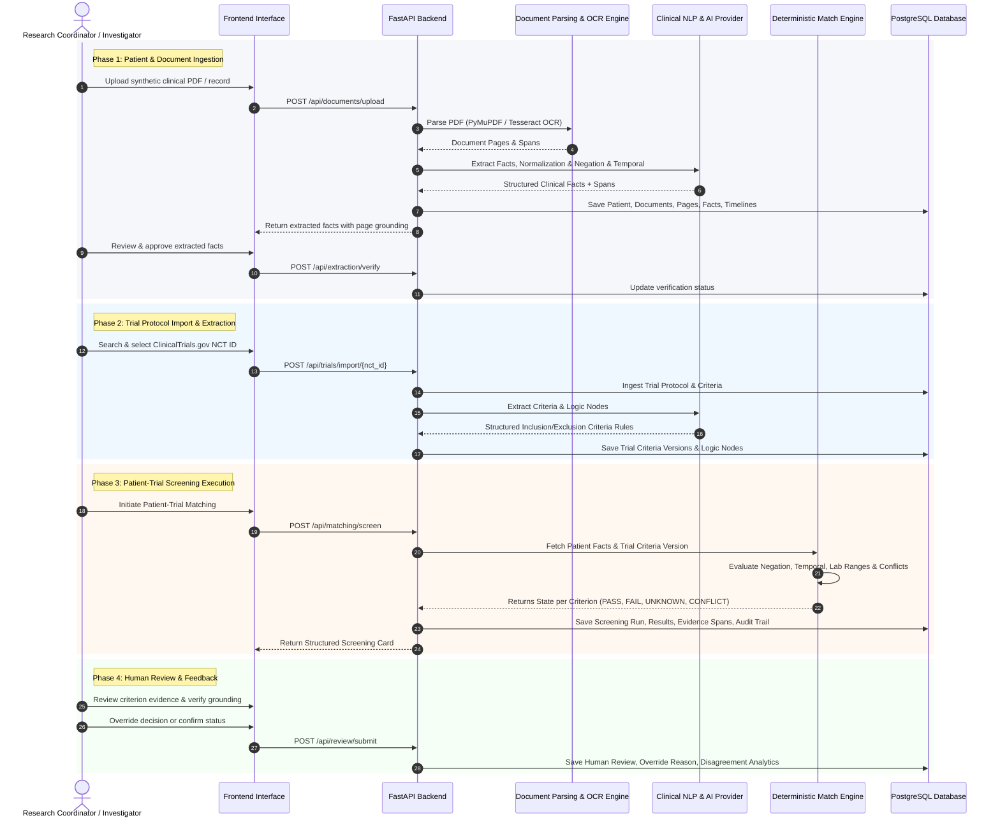

# System Workflow & Core Pipeline

## 1. End-to-End Clinical Trial Matching Pipeline

---

## 2. Detailed Pipeline Stages

### Stage 1: Document Processing & Fact Extraction
1. **Document Upload**: PDF parsed into page-level text blocks (`document_pages`).
2. **Fact Extraction**: Rule-based regex + AI Provider extract conditions, labs, medications, biomarkers, and procedures.
3. **Evidence Linkage**: Every fact registers character offsets (`start_char`, `end_char`) and page index for visual highlighting.

### Stage 2: Normalization, Negation & Temporal Processing
1. **Terminology Mapping**: Maps raw terms to standardized labels (SNOMED, RxNorm, LOINC, ICD-10) with mapping method & confidence. Preserves raw text.
2. **Negation Detection**: Identifies scope of negation triggers (e.g., "denies shortness of breath", "negative for EGFR mutation").
3. **Temporal Reasoning**: Computes reference date deltas (e.g., "within last 6 months", "prior to enrollment").

### Stage 3: Deterministic Rule Engine Matching
For each trial criterion:
1. **Fact Retrieval**: Query normalized facts active during criterion temporal window.
2. **Conflict Check**: If contradictory evidence exists (e.g., two different biomarker statuses in the same window), state becomes `CONFLICT`.
3. **Missing Data Check**: If required test/lab is absent, state becomes `UNKNOWN`.
4. **Rule Evaluation**:
   - Inclusion matched & met $\rightarrow$ `PASS`
   - Inclusion matched & violated $\rightarrow$ `FAIL`
   - Exclusion matched & present $\rightarrow$ `FAIL`
   - Exclusion matched & absent $\rightarrow$ `PASS`

### Stage 4: Continuous Re-screening & Criteria Impact
- When patient lab/condition or trial criterion version changes:
  1. Background job detects affected patient-trial pairs (`re_screening_jobs`).
  2. Re-runs screening pipeline.
  3. Generates diff comparing `old_decision` vs `new_decision`.
  4. Alerts assigned coordinator if status changed.
